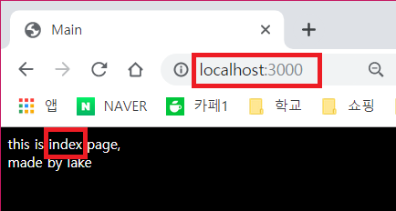
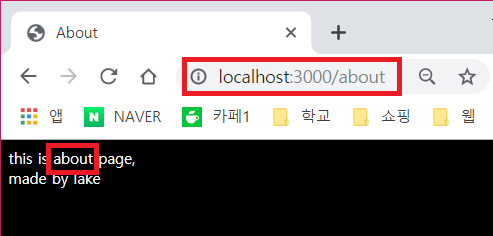

# 📱 node.js의 express 프레임워크 이용해보기
---

### 1. package.json 작성
`npm init` : 프로젝트에 대한 여러 정보를 입력하고 기본적인 package.json을 생성해준다.

```json
{
  "name": "express-tutorial",
  "version": "1.0.0",
  "description": "",
  "main": "index.js",
  "scripts": {
    "test": "echo \"Error: no test specified\" && exit 1"
  },
  "repository": {
    "type": "git",
    "url": "git+https://github.com/leehosu/express-tutorial.git"
  },
  "author": "",
  "license": "ISC"
}

```

### 1-1. NPM으로 dependency 설치
`npm install`

### 2. express 서버 생성
- `npm install express` 명령어로 express 의존성 패키지를 설치한 후 server.js를 만들어 코드를 입력한다.

> 파일 위치 : ../server.js
```js
var express = require('express');
var app = express();
var server = app.listen(3000, function(){
    console.log("Express server has started on port 3000")
})
```
- 그 후 `node server.js` 명령어를 입력한 후 웹 브라우저를 실행시킨 뒤 `localhost://3000`를 입력하여 서버를 확인한다.
- 그 결과는 `Cannot GET/` 일것이다. 왜? Router를 설정하지 않았으니까!

### 3. Router로 Request 처리하기
- 현재 서버를 돌리기위해 모든 준비를 끝냈고 브라우저에서 Request가 왔을때 서버에서 어떤 작업을 해야하는지 Router를 통해 설정해줘야한다.

```js
app.get('/',function(req,res){
    res.send('Hello World');
});
```
- 위 코드를 server.js에 작성 후 `node server.js` 명령어를 재실행하면 `http://localhost:3000/`로 접속하였을때 `Hello World`를 반환한다.

### 3-1. Router 설정
- root 경로에 router 디렉터리를 만든 후 `main.js`파일을 생성한다.

```js
module.exports = function(app){
    app.get('/', function(req,res){
        res.render('index.html');
    });
    app.get('/about', function(req,res){
        res.render('about.html');
    });
}
```
- 위 코드는 url이 `/` 일때나 `/about` 일때 다른 html 파일을 처리하기 위해 구분해주는 역할을 한다.

### 4. HTML 페이지 띄우기
- root 경로에 views 디렉터리를 만든 후 `index.html`과 `about.html`을 만든다.

> 파일 경로 : /views/index.html
```html
<html>
  <head>
    <title>Main</title>
    <link rel="stylesheet" type="text/css" href="css/style.css">
  </head>
  <body>
    this is index page,
    made by lake
  </body>
</html>
```

> 파일 경로 : /views/about.html
```html
<html>
  <head>
    <title>About</title>
    <link rel="stylesheet" type="text/css" href="css/style.css">
  </head>
  <body>
    this is about page,
    made by lake
  </body>
</html>
```

- 그 후 server.js를 수정한다.

> 파일 위치 : /server.js
```js
var express = require('express');
var app = express();
var router = require('./router/main')(app);

app.set('views',__dirname + '/views');
app.set('view engine','ejs');
app.engine('html',require('ejs').renderFile);

var server = app.listen(3000, function(){
    console.log("Express server has started on port 3000")
})

app.use(express.static('public'));
```
- `var router = require('./router/main')(app);` : router 모듈인 main.js를 불러와서 app에 전달해준다.
- `app.set('views',__dirname + '/views');` : 서버가 읽을 수 있게 HTML의 위치를 지정해준다. 여기서는 `/views` 파일이다.
- `app.set('view engine','ejs');`
`app.engine('html',require('ejs').renderFile);` 
: 서버가 HTML을 렌더링할때에 EJS를 사용하도록 설정한다.

### 5. 정적인 파일 다루기
- 정적 파일이란? HTML에서 사용되는 .js 파일, css 파일, image 파일등을 가리킨다. 
- 서버에서 정적인 파일을 다루기 위해서는 `express.static()` 메소드를 이용하면 된다.

> 파일 위치 : /public/css/style.css
```css
body{
	background-color: black;
	color: white;
}
```
- 위의 css 파일을 추가한 후 정적인 파일을 사용하기 위해 `server.js` 파일에 아래의 코드를 추가한다.

```js
app.use(express.static('public'));
```

### 6. 실행
`node server.js` 명령어로 서버를 실행한 후 브라우저로 접속해보면 완성.



