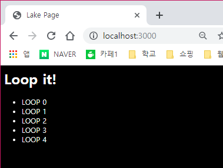

# 📚 node.js의 express 프레임워크 이용해보기 - ejs 사용

---
- 이번 chapter에서는 EJS 엔진과 추가적으로 RESTful API, 그리고 session에 대해서는 공부해본다.
---

## 1. Update package.json 
```json
{
    ...,
    "dependencies":
    {
        ...,
        "body-parser" : "~1.14.2",
        "express-session" : "~1.13.0"
    }
}
```
- package.json을 업데이트 한 후 명령어를 실행해 모듈을 설치한다.
`npm install ejs`
`npm install body-parser`
`npm install express-session`

## 2. Update server.js
```js
var express = require('express');
var app = express();
var bodyParser = require('body-parser');
var session = require('express-session');
var fs = require('fs');

app.set('views',__dirname + '/views');
app.set('view engine','ejs');
app.engine('html',require('ejs').renderFile);

var server = app.listen(3000, function(){
    console.log("Express server has started on port 3000")
})

app.use(express.static('public'));

app.use(bodyParser.json());
app.use(bodyParser.urlencoded());
app.use(session({
    secret: '@#@$MYSIGN#@$#$',
    resave: false,
    saveUninitialized: true
}));

var router = require('./router/main')(app,fs);
```

>  express 이전의 버전에서는 cookie-parser 모듈도 불러와야했지만, 이젠 express-session 모듈이 직접 cookie에 접근하므로 cookie-parer를 더 이상 사용하지 않아도 된다.

- node.js에 내장되어있는 fs 모듈을 불러왔는데, 이는 나중에 file을 열기 위함이다. 또, router에서 fs 모듈을 사용 할 수 있도록 인자로 추가해준다. (주의! fs를 선언하는 부분이 bodyParser 설정 아래부분에 있다면 제대로 작동하지 않는다.)

#### session part
- 위의 `server.js`의 코드에서 session 부분에 대해 살펴본다.
```js
...
app.use(session({
    secret: '@#@$MYSIGN#@$#$',
    resave: false,
    saveUninitialized: true
}));
...
```
- secret : 쿠키를 임의로 변조하는 것을 방지하기 위한 sign 값이다. 원하는 값을 넣으면 된다.
- resave : session을 언제나 저장할 지( 변경되지 않아도 ) 정하는 값이다. express-session document에서는 이 값을 `false`로 하는 것을 권장하고 필요에 따라 true로 설정한다.
- saveUnitialized : unitialized 세션이란 새로 생겼지만 변경되지 않는 세션을 의미한다. document에서는 이 값을 true로 설정하는 것을 권장한다.

## 3. EJS templete engine
- templete 엔진이란, templete를 읽어 엔진의 문법과 설정에 따라서 파일을 HTML 형식으로 변환시키는 모듈이다. 
- `<% %>`를 사용하여 서버의 데이터를 사용하거나 코드를 실행시킨다.

1. <% JavaScript 코드 %>
2. <%= 출력할 JavaScript 객체 %>

#### view로 데이터 넘기기
> 파일 위치 : router/main.js
```js
module.exports = function(app, fs){
    app.get('/', function(req,res){
        res.render('index', {
            title : "Lake Page",
            length : 5
        })
    });
}
```
- JSON 데이터를 render 메소드의 두번째 인자로 전달함으로서 page에서 데이터를 사용 가능하게 합니다.

#### view 에서 데이터 접근 및 루프 코드
> 파일 위치 : views/index.ejs
```html
<html>
  <head>
  <title><%= title %></title>
    <link rel="stylesheet" type="text/css" href="css/style.css">
  </head>
  <body>
    <h1>Loop it!</h1>
    <ul>
        <% for(var i=0; i<length; i++){ %>
            <li>
                <%= "LOOP " + i %>
            </li>
        <% } %>
    </ul>
  </body>
</html>
```

- `<title><%= title %></title>` : router에서 title을 받아와서 출력시킨다.

#### 출력
`node server.js` 명령어를 실행 한 후 브라우저에서 `localhost:3000`를 입력 후 확인해본다.




## 4. division ejs file 
- EJS에서도 코드를 여러 파일로 분리하고 불러와서 사용가능하다.
- `<% include FILENAME %>` 코드를 사용한다.

> 파일 위치 : views/header.ejs
```html
<title>
    <%= title %>
</title>
<link rel="stylesheet" type="text/css" href="css/style.css">
<script>
   console.log("HelloWorld");
</script>
```

> 파일 위치 : views/body.ejs
```html
<h1>Loop it!</h1>
<ul>
    <% for(var i=0; i<length; i++){ %>
        <li>
            <%= "LOOP " + i %>
        </li>
    <% } %>
</ul>
```

> 파일 위치 : views/index.ejs
```html
<html>
  <head>
    <% include ./header.ejs %>  
  </head>
  <body>
    <% include ./body.ejs %>
  </body>
</html>
```