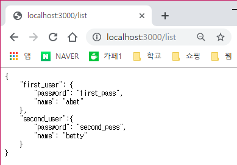
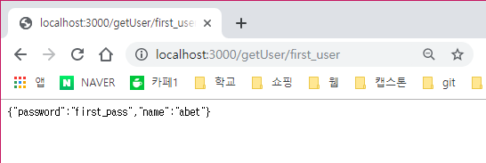
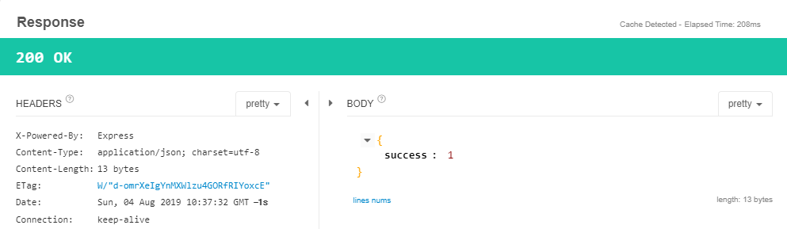

# 🌹 node.js의 express 프레임워크 이용해보기 - RESTful API 사용

---
- REST는 **R**epresentational **S**tate **T**ransfer의 약자로서, WWW와 같은 하이퍼미디어 시스템을 위한 소프트웨어 아키텍쳐 중 하나의 형식이다. 
- REST 서버는 클라이언트로 하여금 HTTP 프로토콜을 사용해 서버의 정보에 접근과 변경을 가능하게 한다.
---

## HTTP 메소드
- REST 기반 아키턱쳐에서 자주 사용되는 메소드는 4가지로 아래와 같다.
    1. GET - 조회
    2. PUT - 생성 및 업데이트
    3. DELETE - 제거
    4. POST - 생성

## Create DataBase
- JSON 기반의 사용자 데이터베이스를 만들어본다.
```JSON
{
    "first_user": {
        "password": "first_pass",
        "name": "abet"
    },
    "second_user":{
        "password": "second_pass",
        "name": "betty"
    }
}
```

## APT : GET
- 모든   유저 리스트를 출력하는 GET API를 만들어본다.
- `user.json`파일을 읽어야하니 fs 모듈을 사용한다.

> 파일 위치 : router/main.js
```js
module.exports = function(app, fs){
    app.get('/', function(req,res){
        res.render('index',{
            title : "Lake Page",
            length : 5
        })
    });

    app.get('/list', function(req,res){
       fs.readFile( __dirname + "/../data/" + "user.json" ,'utf8', function(err,data){
           console.log(data);
           res.end(data);
       }); 
    })
}
```
- `__dirname`은 현재 모듈의 위치를 나타낸다. router 모듈은 router 폴더에 들어있으니 data 폴더에 접근하려면 `/../`를 붙여 먼저 상위 폴더로 접근해야한다.

- 서버를 실행 후 `localhost:3000`에 접속한다.



## API : GET/getUser/:username
- 특정 유저 username의 정보를 가져오는 GET API를 작성한다.

> 파일 위치 : router/main.js

```js
app.get('/getUser/:username', function(req,res){
    fs.readFile( __dirname + "/../data/user.json","utf8", function(err, data){
        var users = JSON.parse(data);
        res.json(users[req.params.username]);
    });
});
```
- `/data/user.json`을 읽은 후 user id를 찾아서 출력해준다.
- `fs.readFile()`로 파일을 읽었을 시에 text 형태로 읽어지기 때문에 JSON.parse()를 해줘야한다.

- 서버 실행 후 'localhost:3000/getUser/first_user`로 접속한다.




## API : POST addUser/:username
`body : {"password":"___","name":"___"}`

- HTTP 패킷을 요청하고 분석하는 크롬 확장프로그램인 `Result Client`를 사용한다.

> 파일 위치 : router/main.js
```js
    app.post('/addUser/:username', function(req, res){

        var result = {  };
        var username = req.params.username;

        // CHECK REQ VALIDITY
        if(req.body["password"] || req.body["name"]){
            result["success"] = 0;
            result["error"] = "invalid request";
            res.json(result);
            return;
        }

        // LOAD DATA & CHECK DUPLICATION
        fs.readFile( __dirname + "/../data/user.json", 'utf8',  function(err, data){
            var users = JSON.parse(data);
            if(users[username]){
                // DUPLICATION FOUND
                result["success"] = 0;
                result["error"] = "duplicate";
                res.json(result);
                return;
            }

            // ADD TO DATA
            users[username] = req.body;

            // SAVE DATA
            fs.writeFile(__dirname + "/../data/user.json",
                         JSON.stringify(users, null, '\t'), "utf8", function(err, data){
                result = {"success": 1};
                res.json(result);
            })
        })
    });
```
- JSON 형태가 다르다면 오류를 반환하고 같으면 파일을 열어서 username의 중복성을 확인 한 후 JSON 데이터에 추가하여 저장한다.

- `Result Client`에서 `localhost:3000/addUser/newueser`에 접속한다.



