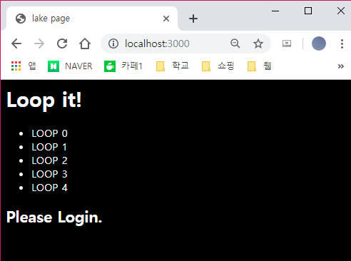
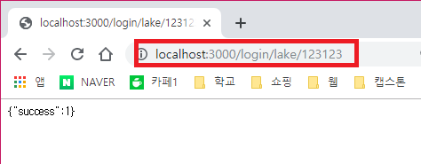
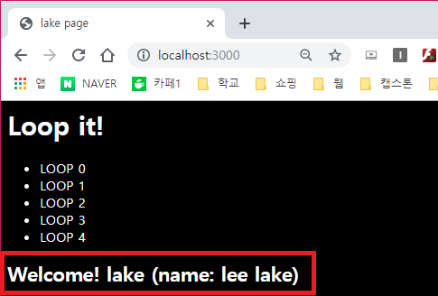

# 🎤 node.js의 express 프레임워크 이용해보기 - express-session 사용

---
- express-session은 Express 프레임워크에서 session을 관리하기 위해 필요한 미들웨어이다.
- express-session을 통해 로그인 및 로그아웃을 구현해본다.
---

## Use Example

#### Express에 적용
```js
var session = require('express-session');

app.use(session({
 secret: '@#@$MYSIGN#@$#$',
 resave: false,
 saveUninitialized: true
}));
```
- secret : 쿠키를 임의로 변조하는것을 방지하기 위한 값이다. 이 값을 통하여 세션을 암호화 하여 저장한다.
- resave : 세션을 언제나 저장할 지 (변경되지 않아도) 정하는 값이다. express-session document에서는 이 값을 false 로 하는것을 권장하고 필요에 따라 true로 설정한다.
- saveUninitialized : 세션이 저장되기 전에 uninitialized 상태로 미리 만들어서 저장한다.

#### Session Initialiaztion
```js
app.get('/', function(req, res){
    sess = req.session;
});
```
- 이렇게 간단하게 router 콜백 함수 안에서 req.session으로 session에 접근 할 수 있다.

#### Use Session Veriable
```js
app.get('/', function(req, res){
    sess = req.session;
    console.log(sess.username);
});
```

#### Remove Session
```js
req.session.destroy(function(err){
   // cannot access session here
});
```
- session을 제거할때(로그아웃) 위와 같이 한다.
- destory() 메소드의 콜백 함수에서는 세션에 접근 할 수 없다.

## Start
#### Login API
> 파일 위치 : router/main.js

```js
app.get('/login/:username/:password', function(req, res){
        var sess;
        sess = req.session;

        fs.readFile(__dirname + "/../data/user.json", "utf8", function(err, data){
            var users = JSON.parse(data);
            var username = req.params.username;
            var password = req.params.password;
            var result = {};
            if(!users[username]){
                // USERNAME NOT FOUND
                result["success"] = 0;
                result["error"] = "not found";
                res.json(result);
                return;
            }

            if(users[username]["password"] == password){
                result["success"] = 1;
                sess.username = username;
                sess.name = users[username]["name"];
                res.json(result);

            }else{
                result["success"] = 0;
                result["error"] = "incorrect";
                res.json(result);
            }
        })
    });
```
- 로그인에 성공했다면 session에 username과 name을 저장한다.

#### Logout API
```js
    app.get('/logout', function(req, res){
        sess = req.session;
        if(sess.username){
            req.session.destroy(function(err){
                if(err){
                    console.log(err);
                }else{
                    res.redirect('/');
                }
            })
        }else{
            res.redirect('/');
        }
    })
```
- 로그아웃을 하면 메인 페이지로 redirect됩니다.

#### main page 수정
```js
    app.get('/',function(req,res){
         var sess = req.session;


         res.render('index', {
             title: "MY HOMEPAGE",
             length: 5,
             name: sess.name,
             username: sess.username
         })
     });
```
- 메인 페이지에서 session을 조회 할 수 있도록 수정한다.
- ejs 템플릿 엔진에 전달하게 만들었고 ejs 에서 데이터를 받아 올 수 있다.

#### body.ejs 수정
```html
<h1>Loop it!</h1>
<ul>
    <% for(var i=0; i<length; i++){ %>
        <li>
            <%= "LOOP" + i %>
        </li>
    <% } %>
</ul>

<% if(username){ %>
    <h2>Welcome! <%= username %> (name: <%= name %>)</h2>
<% }else{ %>
    <h2> Please Login. </h2>
<% } %>
```
- 로그인에 성공했다면 환영 메시지가 나오고 아니면 로그인하라고 나온다.

## Final

1. `localhost:3000`에 접속한다.



2. 로그인을 위해 로그인 API인 `/login/username/password`를 입력한다. ( 주의 ! 유저정보는 `data/user.json`에 입력되어 있어야 한다.)



3. 로그인 되었는지 main 페이지에서 확인한다.



4. `localhost:3000/logout`을 입력하여 logout API를 실행한다. 


- main page로 redirect 되기 때문에 바로 초기화면으로 돌아온다.